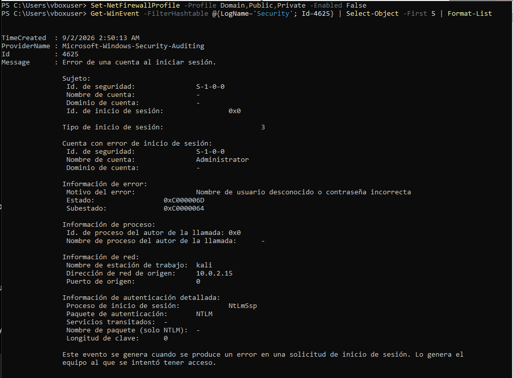

# 🛡️ Reporte de Laboratorio: Detección y Análisis de Fuerza Bruta en RDP

**Fecha:** 2 de Septiembre, 2026  
**Autor:** Tec. Michel Cueto  
**Perfil / Rol:** Analista de Ciberseguridad (Blue / Purple Team)  
**Entorno / Plataforma:** Home Lab Local (VirtualBox / NatNetwork)  
**Dificultad / Tipo:** Principiante / Análisis de Logs / Hardening  

---

## 1. Resumen Ejecutivo

Durante este ejercicio práctico de laboratorio se simuló un ataque de fuerza bruta dirigido al puerto RDP (3389) de un servidor Windows Server 2025. El objetivo principal fue auditar los eventos de seguridad del sistema, identificar el vector de ataque generado desde Kali Linux, analizar el registro de eventos en vivo mediante PowerShell y aplicar políticas de endurecimiento de seguridad (*hardening*) para mitigar accesos no autorizados.

---

## 2. Topología del Laboratorio

* **Atacante (Kali Linux):** IP `10.0.2.15`
* **Víctima (Windows Server 2025):** IP `10.0.2.4`
* **Red Virtual:** Red NAT aislada en VirtualBox (`NatNetwork`)
* **Monitoreo:** Registros de Auditoría de Windows (Security Log) via PowerShell

---

## 3. Metodología y Hallazgos Técnicos

### Paso 1: Reconocimiento y Detección de Puertos
Desde la máquina atacante se verificó la conectividad ICMP hacia la víctima y se escaneó el puerto RDP para confirmar que el servicio estuviera escuchando.

bash
```bash
# Verificación de conectividad y escaneo del puerto objetivo
ping -c 4 10.0.2.4
nmap -p 3389 10.0.2.4

# Verificación de conectividad y escaneo del puerto objetivo
ping -c 4 10.0.2.4
nmap -p 3389 10.0.2.4
Paso 2: Simulación del Ataque de Fuerza Bruta
Se utilizó la herramienta Hydra para ejecutar múltiples intentos fallidos de autenticación automatizados sobre la cuenta Administrator.

bash
# Creación de diccionario de prueba y ejecución de la prueba de penetración
echo -e "123456\npassword\nadmin123\nPrueba2026\nIncorrecta1" > pass.txt
hydra -l Administrator -P pass.txt rdp://10.0.2.4
Paso 3: Análisis Forense de Logs en Windows Server
* **Evidencia de Auditoría:**  

Para auditar el ataque sin depender de interfaz gráfica, se utilizó el cmdlet moderno Get-WinEvent en PowerShell para consultar directamente el registro de seguridad.

PowerShell
# Consulta de los últimos 5 eventos de falla de inicio de sesión
Get-WinEvent -FilterHashtable @{LogName='Security'; Id=4625} | Select-Object -First 5 | Format-List
Hallazgos identificados en el Event ID 4625:

Cuenta atacada: Administrator

Nombre de estación de trabajo origen: kali

Dirección IP de origen: 10.0.2.15

Motivo del error: Nombre de usuario desconocido o contraseña incorrecta (0xC000006D)

Evidencia de Auditoría:

4. Plan de Remediación y Mitigación
Para mitigar la exposición ante futuros ataques automatizados por diccionario, se aplicaron las siguientes directivas defensivas en el servidor:

Política de Bloqueo de Cuentas (Account Lockout Policy): Se estableció un umbral estricto para bloquear cuentas tras 5 intentos fallidos consecutivos.

PowerShell
net accounts /lockoutthreshold:5 /lockoutduration:15 /lockoutwindow:15
Restricción de Red: Configuración de reglas en el Firewall de Windows para limitar el puerto 3389 únicamente a direcciones IP de administración autorizadas.

5. Conclusión
Este laboratorio permitió validar el flujo completo de detección de intrusiones mediante el análisis de Event Logs de Windows en tiempo real. La implementación de la directiva de bloqueo de cuentas demostró ser efectiva para neutralizar vectores de fuerza bruta antes de que un atacante logre comprometer credenciales válidas.
